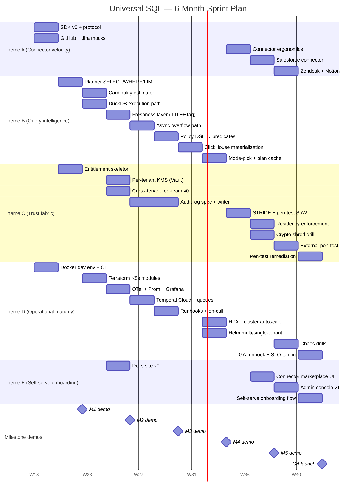

# Sprint Planning — 12 × 2-week sprints

> Operational expansion of [`02-execution-plan.md`](02-execution-plan.md).
> The roadmap there is told in months/themes; this doc is told in sprints
> with named tasks, owners, deliverables, and a Gantt chart.
>
> **Cadence:** 2-week sprints, 12 sprints over 6 months. Each milestone
> (M1–M6) is exactly 2 sprints. Final ship date = end of Sprint 12.
>
> **Staffing assumption (revised):** the full 7.5 FTE team is in place
> from Sprint 1. No hiring contingencies; no role ramps mid-plan.

---

## 1. Team & capacity

| Role | FTE | Sprint name |
|---|---|---|
| Engineering Manager | 1.0 | EM |
| Tech Lead / Staff Eng | 1.0 | TL |
| Backend Eng (×2) | 2.0 | BE1, BE2 |
| Platform / Infra Eng | 1.0 | INFRA |
| Security Eng | 0.5 | SEC |
| QA / SDET | 1.0 | QA |
| Product Manager | 0.5 | PM |
| Developer Experience | 0.5 | DX |
| **Total** | **7.5** | |

All roles staffed from Sprint 1. SEC stays at 0.5 FTE for the whole
plan — security-heavy work that originally relied on a SEC ramp
(audit log writer, crypto-shred automation, pen-test execution) is
distributed across BE/INFRA/external vendor, with SEC owning **spec,
review, and validation**.

**Net feature capacity per sprint** ≈ 7.5 × 10 working days × 0.7
(removing ceremonies, code review, on-call, support) ≈ **52 ideal
person-days/sprint**.

---

## 2. Ceremonies

| When | Event | Length |
|---|---|---|
| Sprint Day 1 (Mon) | Sprint planning | 2 h |
| Daily | Standup | 15 min |
| Sprint Day 9 | Mid-sprint check-in (status + risks) | 30 min |
| Sprint Day 10 (Fri) | Sprint review / demo | 1 h |
| Sprint Day 10 (Fri) | Retrospective | 45 min |
| Sprint Day 10 (Fri) | Backlog refinement for next sprint | 1 h |
| Every 2 sprints | **Milestone demo** to stakeholders + scorecard review | 1.5 h |

Quarterly (every 6 sprints): RICE-prioritised backlog re-plan; risk
register refresh; budget review.

---

## 3. Sprint-by-sprint plan

Notation: each task line is `[OWNER] task — effort`.
Effort is a relative estimate (S = ≤ 2 d, M = 3–5 d, L = 6–8 d, XL = ≥ 9 d).

---

### Sprint 1 — `M1.1` Foundations: SDK + plumbing
**Weeks 1–2** · Theme contributions: A, B, C, D

| Task | Owner | Effort |
|---|---|---|
| Connector SDK v0 — protocol definition + capability descriptor schema | TL | M |
| GitHub mock connector + capability descriptor | BE1 | M |
| Jira mock connector + capability descriptor | BE2 | M |
| Repo bootstrap, Docker dev env, structured logging | INFRA | M |
| Threat model v0 + tenant data model design | SEC | S |
| Pytest framework + first contract test | QA | S |
| Design-partner outreach — gather first cross-app query | PM | S |
| Connector author guide skeleton | DX | S |
| Sprint cadence + OKRs; vendor procurement (Vault, Temporal Cloud, ClickHouse Cloud) | EM | S |

**Deliverable:** Connector SDK protocol document; one connector with a passing contract test; Docker dev env runs locally.

**Demo:** Hello-world connector contract test passing in CI.

**Risks:** SDK shape churn — mitigate by versioning the descriptor from day 1.

---

### Sprint 2 — `M1.2` Foundations: vertical slice + M1 demo
**Weeks 3–4** · Theme contributions: A, B, C, D

| Task | Owner | Effort |
|---|---|---|
| SQL planner: SELECT/WHERE/LIMIT via sqlglot; predicate pushdown skeleton | TL | L |
| Entitlement service skeleton + YAML loader; table-level grants | BE1 | M |
| Rate-limit guardrail v0 (in-process token bucket, 1 scope) | BE2 | M |
| FastAPI gateway skeleton; `/v1/query` endpoint; container build | INFRA | M |
| Per-tenant cache key scoping (correctness review) | SEC | S |
| End-to-end test exercising the slice; rate-limit exhaustion test | QA | M |
| First internal pilot tenant signed up | PM | S |
| Connector contribution workflow doc | DX | S |
| **M1 demo prep** + exec readout | EM | S |

**Deliverable (M1 exit):** 1 internal tenant runs the GitHub↔Jira reference query end-to-end. Rate-limit guardrail validated at 110% budget. New connector "hello world" ships in ≤ 4 hours (DX measurement).

**Demo:** M1 stakeholder demo — full request flow, response envelope, rate-limit error path.

**Risks:** sqlglot quirks for non-standard syntax — kept SQL surface tight to the supported subset.

---

### Sprint 3 — `M2.1` Productionisation: estimator + DuckDB
**Weeks 5–6** · Theme contributions: B, C, D

| Task | Owner | Effort |
|---|---|---|
| Cardinality estimator v0 (capability bounds + EWMA over Redis) | TL | L |
| DuckDB execution path for cross-source joins; tmpfs scratch | BE1 | L |
| Integrate estimator with planner mode-pick logic | BE2 | M |
| K8s cluster provisioning (Terraform module: VPC, EKS, security groups) | INFRA | L |
| Per-tenant KMS via Vault — design + spike PR | SEC | M |
| Load test scaffold — k6 in CI | QA | M |
| 2 design-partner agreements signed | PM | M |
| Connector contribution PR-template + checklist | DX | S |
| Quarterly RICE re-rank; design-partner contracts review with Legal | EM | S |

**Deliverable:** DuckDB mode active; estimator decisions logged; K8s cluster provisioned via Terraform.

**Demo:** Cross-source join executing through DuckDB, visible in trace.

---

### Sprint 4 — `M2.2` Productionisation: KMS + observability + M2 demo
**Weeks 7–8** · Theme contributions: B, C, D

| Task | Owner | Effort |
|---|---|---|
| Freshness layer (TTL + ETag); cache hit/miss in response envelope | TL | M |
| Per-tenant KMS data-key wrapping integrated with cache layer | BE1 | L |
| Multi-tenant deploy on k8s namespaces; NetworkPolicy templates | BE2 | M |
| OTel collector + Prometheus + Grafana stack; Helm chart v0 | INFRA | L |
| Cross-tenant leak test harness review (red-team v0 spec) | SEC | M |
| Cross-tenant leak test execution + remediation | QA | M |
| 2 design partners onboarded to staging | PM | M |
| Docs site v0 (Docusaurus) + first 5 pages | DX | M |
| **M2 demo prep** + scorecard update | EM | S |

**Deliverable (M2 exit):** P95 < 1.8 s for single-source pushdown queries. 2 tenants share a cluster with **zero** cross-tenant data in traces/logs (verified by automated harness). Trace shows per-source connector time.

**Demo:** Two tenants running parallel queries; trace + metrics dashboard visible.

---

### Sprint 5 — `M3.1` Resilience: async path + error vocab
**Weeks 9–10** · Theme contributions: B, C, D

| Task | Owner | Effort |
|---|---|---|
| Standard error vocabulary (`RATE_LIMIT_EXHAUSTED`, `STALE_DATA`, etc.) + envelope types | TL | M |
| Async overflow path — Temporal workflow integration | BE1 | L |
| Job status endpoint + push-notification webhook on completion | BE2 | M |
| Temporal Cloud setup; queue-depth alerts | INFRA | M |
| Audit log spec + signing protocol design (HMAC + Kafka schema) | SEC | M |
| Throttled-load tests — graceful-degradation scenarios | QA | M |
| 1 production design partner ready to migrate | PM | S |
| Error-codes documentation page | DX | S |
| Status-page setup + first synthetic monitor | EM | S |

**Deliverable:** Throttled load test passes — user always gets actionable error or async path. Async job lifecycle demoable end-to-end.

**Demo:** Run a deliberately-throttled query; show 429 → opt into async URL → notification → result fetched.

---

### Sprint 6 — `M3.2` Resilience: policy DSL + audit + M3 demo
**Weeks 11–12** · Theme contributions: C, D

| Task | Owner | Effort |
|---|---|---|
| Policy DSL (Rego) → predicate compiler integration | TL | L |
| RLS predicate pre-filters wired into planner pushdown | BE1 | M |
| CLS column masks + **audit log writer service** (per SEC's spec) | BE2 | L |
| On-call rotation; PagerDuty wiring; runbooks for top-3 failure modes | INFRA | M |
| Audit writer review + signing-key rotation drill | SEC | M |
| Red-team test suite — 3 scenarios; 0-leak gate on PRs | QA | M |
| 3rd design partner onboarded to staging | PM | S |
| Policy-authoring guide + examples | DX | M |
| **M3 demo prep**; scorecard update | EM | S |

**Deliverable (M3 exit):** RLS/CLS verified by red-team suite (0 leaks). Audit log captures 100% of cross-system access events. Clean UX under throttling.

**Demo:** Live policy edit → query result changes for affected user → audit log shows the policy evaluation.

> **Note on workload distribution:** the audit log writer (originally
> SEC-owned in earlier drafts) is implemented by BE2 against the SEC
> spec from Sprint 5. SEC keeps spec ownership and signing-key rotation
> review — the security boundary stays with SEC, the production code
> with engineering.

---

### Sprint 7 — `M4.1` Scale: ClickHouse + semi-join
**Weeks 13–14** · Theme contributions: B, D

| Task | Owner | Effort |
|---|---|---|
| Hot-query detection + planner mode promotion to materialised | TL | L |
| ClickHouse table lifecycle (create, refresh, TTL ≤ 5 min) | BE1 | L |
| Semi-join pushdown optimisation (extract IN-list to second source) | BE2 | M |
| ClickHouse Cloud setup; per-tenant schemas; encryption at rest | INFRA | M |
| ClickHouse table-level encryption review (per-tenant DEK) | SEC | M |
| Materialisation correctness tests; concurrent-refresh scenarios | QA | M |
| Hot-tenant identification with Product (which dashboards repeat?) | PM | S |
| Materialisation observability docs | DX | S |
| Cost-guardrail design + budget cap policy spike | EM | S |

**Deliverable:** ClickHouse mode active for hot queries; semi-join pushdown reduces fanout 10×; first per-tenant cost report.

**Demo:** Same query: first call DuckDB, third call promoted to ClickHouse — show source-fetch reduction.

---

### Sprint 8 — `M4.2` Scale: autoscaling + M4 demo
**Weeks 15–16** · Theme contributions: B, D

| Task | Owner | Effort |
|---|---|---|
| Mode-pick logic finalised (hot path); query-plan cache | TL | M |
| HPA configurations; planner queue-depth metric exporter | BE1 | M |
| Connector worker autoscaling; pool warm-pods | BE2 | M |
| Cluster autoscaler; canary + automated rollback on SLO regression; multi/single-tenant Helm flags | INFRA | L |
| Cost-guardrail enforcement (per-tenant query budget; rejection path) | SEC | M |
| 1k QPS synthetic load test; bottleneck profiling | QA | L |
| GA pricing model draft with Finance | PM | M |
| Deploy guide for single-tenant variant | DX | M |
| **M4 demo prep**; scorecard | EM | S |

**Deliverable (M4 exit):** 1k QPS for 60 s with P95 < 1.5 s. Same Helm chart deploys multi-tenant or single-tenant with one flag. Cost / 1000 queries ≤ $0.75.

**Demo:** Live 1k QPS load test, dashboard streaming, single-tenant deploy from same chart.

---

### Sprint 9 — `M5.1` GA-readiness: connector breadth (Salesforce)
**Weeks 17–18** · Theme contributions: A, C, D

| Task | Owner | Effort |
|---|---|---|
| Connector ergonomics review; SDK v1 spec | TL | M |
| Salesforce connector (live + mock); SOQL pushdown | BE1 | L |
| Salesforce capability descriptor + rate-limit shaping | BE2 | M |
| VPC peering / PrivateLink option for source-side DLP customers | INFRA | M |
| STRIDE threat-model document + pen-test SoW with vendor | SEC | M |
| Contract-test suite for new connector + drift detection | QA | M |
| Salesforce design-partner sign-off + production credentials | PM | S |
| "How we onboard a new SaaS source" blog post + demo video | DX | M |
| External pen-test vendor selection finalised | EM | S |

**Deliverable:** Salesforce connector live in staging; SLOs verified; threat model + pen-test SoW signed.

**Demo:** Cross-app query Salesforce ↔ Zendesk (tickets ↔ accounts) running on the platform.

---

### Sprint 10 — `M5.2` GA-readiness: connector breadth + security depth + M5 demo
**Weeks 19–20** · Theme contributions: A, C, D

| Task | Owner | Effort |
|---|---|---|
| **Crypto-shred mechanism design** (KMS revocation flow + reference impl) | TL | L |
| Zendesk connector | BE1 | L |
| Notion connector | BE2 | L |
| Residency-tag enforcement (admission controller + scheduler annotations); **crypto-shred automation** | INFRA | L |
| Off-boarding drill validation + sign-off (SEC owns the gate) | SEC | M |
| Residency-violation test harness; off-boarding drill execution | QA | M |
| Salesforce + Zendesk design-partner deals signed | PM | M |
| Connector marketplace UI scaffold | DX | M |
| **M5 demo prep**; scorecard | EM | S |

**Deliverable (M5 exit):** 5 production-ready connectors total. Off-boarding drill completes in < 5 min with KMS revoked. Cost / 1000 queries ≤ $0.50. Pen-test SoW signed; vendor scheduled.

**Demo:** Off-boarding drill — tenant deletion + crypto-shred verified by inability to decrypt cached data.

> **Note on workload distribution:** crypto-shred is jointly owned —
> TL designs the mechanism, INFRA automates it, SEC validates and
> signs off the drill. Without this split SEC would be at ~3 units
> on a 0.5 FTE budget.

---

### Sprint 11 — `M6.1` GA: admin console + chaos
**Weeks 21–22** · Theme contributions: C, D, E

| Task | Owner | Effort |
|---|---|---|
| Admin-console API (tenants, connectors, policies, audit log viewer) | TL | L |
| Connector configuration UI integration | BE1 | L |
| Policy editor UI integration | BE2 | L |
| Chaos drills (rate-limit flood, source outage, cache stampede, KMS unavailable) | INFRA | L |
| **External pen-test (vendor executes)**; SEC scopes + triages findings | SEC | M |
| Chaos-drill validation; pen-test finding triage | QA | M |
| GA marketing-materials review with Marketing | PM | S |
| GA documentation freeze; tutorial videos | DX | M |
| GA criteria review; readiness scorecard | EM | S |

**Deliverable:** Admin console v1; chaos drills pass; pen-test findings logged with severity.

**Demo:** Self-serve tenant onboarding via admin console; chaos drill (rate-limit flood) recovers automatically.

> **Note on workload distribution:** the external pen-test vendor
> performs the heavy execution work. SEC's role this sprint is
> scoping, daily liaison, and triage — sized to fit 0.5 FTE.

---

### Sprint 12 — `M6.2` GA: hardening + sign-off
**Weeks 23–24** · Theme contributions: C, D, E

| Task | Owner | Effort |
|---|---|---|
| Pen-test findings remediation (any critical/high) | TL | L |
| Tenant onboarding flow polish; first-run wizard | BE1 | M |
| Self-serve onboarding flow E2E | BE2 | M |
| GA runbook publication; production monitoring tuning; SLO dashboards | INFRA | M |
| Pen-test re-test sign-off; SOC 2 Type 1 control owner mapping | SEC | M |
| Full regression suite; performance tuning round | QA | L |
| 3 production design partners running ≥ 2 weeks; NPS captured | PM | M |
| Onboarding playbook publication; launch announcement copy | DX | M |
| SOC 2 Type 1 evidence collection (cross-team coordination); **GA sign-off** ceremony; half-year retro | EM | M |

**Deliverable (M6 exit / GA):** All 8 north-star metrics green. 3 design-partner tenants in production for ≥ 2 weeks. Tenant onboarding median ≤ 24 hours. Onboarding playbook published. Pen-test all-clear.

**Demo:** **GA launch**.

> **Note on workload distribution:** SOC 2 Type 1 evidence collection
> is coordinated by EM with each role-owner producing artefacts in
> their domain (TL: architecture diagrams; INFRA: deployment proofs;
> SEC: control mapping; QA: test evidence). SEC stays focused on
> control mapping and pen-test re-test, not evidence collection
> across all controls.

---

## 4. Resource allocation matrix

How many "task units" each role takes on per sprint. Helps spot
overload before it happens. (S=1, M=2, L=3, XL=4 effort units;
sustainable load ≈ 4–5 units for 1.0 FTE, ≈ 2 units for 0.5 FTE.)

| Role | FTE | S1 | S2 | S3 | S4 | S5 | S6 | S7 | S8 | S9 | S10 | S11 | S12 |
|------|-----|----|----|----|----|----|----|----|----|----|----|----|----|
| TL | 1.0 | 2 | 3 | 3 | 2 | 2 | 3 | 3 | 2 | 2 | 3 | 3 | 3 |
| BE1 | 1.0 | 2 | 2 | 3 | 3 | 3 | 2 | 3 | 2 | 3 | 3 | 3 | 2 |
| BE2 | 1.0 | 2 | 2 | 2 | 2 | 2 | 3 | 2 | 2 | 2 | 3 | 3 | 2 |
| INFRA | 1.0 | 2 | 2 | 3 | 3 | 2 | 2 | 2 | 3 | 2 | 3 | 3 | 2 |
| SEC | **0.5** | 1 | 1 | 2 | 2 | 2 | 2 | 2 | 2 | 2 | 2 | 2 | 2 |
| QA | 1.0 | 1 | 2 | 2 | 2 | 2 | 2 | 2 | 3 | 2 | 2 | 2 | 3 |
| PM | **0.5** | 1 | 1 | 2 | 2 | 1 | 1 | 1 | 2 | 1 | 2 | 1 | 2 |
| DX | **0.5** | 1 | 1 | 1 | 2 | 1 | 2 | 1 | 2 | 2 | 2 | 2 | 2 |

**SEC capped at 2 units throughout** — explicit constraint, not a
target. The plan never relies on SEC ramping. The three sprints that
would have peaked SEC at 3 units in a hiring-flexible plan are
redistributed:

| Originally SEC peak | Now done by | Sprint |
|---|---|---|
| Audit log writer implementation | BE2 (against SEC spec) | S6 |
| Crypto-shred mechanism + automation | TL design + INFRA automation; SEC validates | S10 |
| External pen-test execution | Vendor; SEC scopes and triages | S11 |
| SOC 2 Type 1 evidence collection | EM coordinates; each role owner contributes; SEC owns control mapping only | S12 |

**Hot spots to watch (engineering load):**
- **TL** at 3 units in S2/S3/S6/S7/S10/S11/S12 — TL is the planner-deep
  contributor and demo presenter. Mitigate burnout by pairing with BE1
  on demo prep.
- **BE1/BE2** at 3 units in second-half sprints (S6, S9, S10, S11) —
  connector breadth and admin console concentrate on backend. PM
  compensates by holding Notion's scope tight.
- **INFRA** at 3 units in S3/S4/S8/S10/S11 — heaviest infra weeks are
  k8s provisioning, autoscaling, residency, and chaos drills. TL has
  reciprocal capacity in those weeks for cross-pairing.

Per-role sustainable thresholds (over a quarter):
- 1.0 FTE: avg ≤ 2.5, peaks ≤ 3 OK with recovery sprints around them.
- 0.5 FTE: hard cap of 2 — exceeding it means overtime or slip.

---

## 5. Gantt chart (Mermaid)

Three formats — pick whichever your viewer supports:

- **Rendered image:** [`gantt.png`](gantt.png) · [`gantt.svg`](gantt.svg) — open in any image viewer
- **Standalone source:** [`gantt.mmd`](gantt.mmd) — paste into <https://mermaid.live> or render with `mmdc`
- **Inline below:** renders natively on GitHub, GitLab, Notion, Obsidian
- **ASCII fallback:** Section 6 below — works in any terminal or plain-text viewer

To re-render after editing the source:
```bash
cd planning
npx -p @mermaid-js/mermaid-cli mmdc -i gantt.mmd -o gantt.png -w 1800 -H 1100
```



---

## 6. ASCII Gantt fallback

For terminals or markdown viewers without Mermaid:

```
                  Sprint:  1   2   3   4   5   6   7   8   9   10  11  12
                  Week  : 1-2 3-4 5-6 7-8 9-10 11-2 13-4 15-6 17-8 19-0 21-2 23-4
                          |   |   |   |    |   |    |    |    |    |    |    |
THEME A — Connector velocity
  SDK v0 + protocol      [▓▓▓]
  GitHub + Jira mocks    [▓▓▓]
  Connector ergonomics                                          [▓▓▓]
  Salesforce                                                    [▓▓▓▓▓▓▓]
  Zendesk + Notion                                                  [▓▓▓]

THEME B — Query intelligence
  Planner subset             [▓▓▓]
  Cardinality estimator              [▓▓▓]
  DuckDB execution                   [▓▓▓]
  Freshness (TTL + ETag)                 [▓▓▓]
  Async overflow                             [▓▓▓]
  Policy DSL → predicates                        [▓▓▓]
  ClickHouse materialisation                         [▓▓▓]
  Mode-pick + plan cache                                 [▓▓▓]

THEME C — Trust fabric
  Entitlement skeleton       [▓▓▓]
  Per-tenant KMS                         [▓▓▓]
  Cross-tenant red-team v0               [▓▓▓]
  Audit log spec + writer                    [▓▓▓▓▓▓]
  STRIDE + pen-test SoW                                       [▓▓▓]
  Residency enforcement                                            [▓▓▓]
  Crypto-shred drill                                               [▓▓▓]
  External pen-test                                                   [▓▓▓]
  Pen-test remediation                                                    [▓▓▓]

THEME D — Operational maturity
  Docker dev env + CI    [▓▓▓]
  Terraform K8s modules          [▓▓▓]
  OTel/Prom/Grafana                  [▓▓▓]
  Temporal Cloud + queues                [▓▓▓]
  Runbooks + on-call                         [▓▓▓]
  HPA + cluster autoscale                            [▓▓▓]
  Helm multi/single-tenant                           [▓▓▓]
  Chaos drills                                                        [▓▓▓]
  GA runbook + SLO tune                                                   [▓▓▓]

THEME E — Self-serve onboarding
  Docs site v0                           [▓▓▓]
  Connector marketplace UI                                         [▓▓▓]
  Admin console v1                                                    [▓▓▓]
  Self-serve onboarding flow                                              [▓▓▓]

MILESTONES                  M1↑       M2↑     M3↑     M4↑    M5↑      GA↑
                          (Sprint 2)(Sp 4) (Sp 6) (Sp 8) (Sp 10) (Sp 12)
```

---

## 7. Dependency graph (key chains)

The Gantt above shows when work happens; this shows what *must* land
before what.

```
SDK protocol (S1) ─┬─► GitHub mock (S1) ─┐
                   └─► Jira   mock (S1) ─┴─► Vertical slice (S2) ─► M1 demo
                                                  │
                                                  ▼
                                          Cardinality estimator (S3) ─► DuckDB mode (S3) ─► M2
                                                  │
                                                  ▼
                                          Freshness layer (S4) ─► Async overflow (S5) ─► M3
                                                  │
                                                  ▼
                                          Policy DSL (S6) ─┬─► RLS pre-filters (S6)
                                                           ├─► CLS masks       (S6)
                                                           └─► Audit writer    (S6) ─► M3
                                                                                │
                                                                                ▼
                                          ClickHouse mat'n (S7) ─► HPA + autoscaler (S8) ─► M4
                                                                                │
                                                                                ▼
                                          Connector breadth (S9-10) ─► STRIDE + pen-test SoW (S9) ─► M5
                                                                                │
                                                                                ▼
                                          Admin console (S11) ─┬─► Chaos drills (S11)
                                                               └─► Pen-test (S11) ─► Remediation (S12) ─► GA
```

**Critical path** (the chain whose slip moves GA):
SDK → vertical slice → estimator → freshness → async path → policy DSL +
audit writer → ClickHouse → autoscaler → connector breadth → admin
console → pen-test remediation → **GA**.

Any single sprint slip on this path moves GA by exactly 2 weeks. Items
*off* the critical path (e.g. blog posts, marketplace UI) can slip
without affecting GA.

---

## 8. Risk register linked to sprints

Risk numbering matches [`02-execution-plan.md`](02-execution-plan.md). R9
(hiring miss) does not apply in the revised plan since the team is
fully staffed from Sprint 1.

| Risk | First exposed at | Mitigation lands at |
|---|---|---|
| R1 Connector variability | S1 (SDK design) | S9 (capability v1 + drift tests) |
| R2 Source quota exhaustion | S2 (rate-limit guard rails) | S5 (async overflow path) |
| R3 Schema drift | S1 (descriptor versioning) | S9 (drift tests) |
| R4 Entitlement bug → leak | S4 (red-team v0) | S6 (red-team suite + audit) |
| R5 Cost overrun | S7 (cost-guardrail design) | S8 (enforcement + budgets) |
| R6 Estimator inaccurate | S3 (estimator v0) | continuous (EWMA + shadow traffic) |
| R7 ClickHouse op load | S7 (managed cloud) | S11 (chaos drill) |
| R8 Design-partner credentials | S3 (sandbox-first) | S5 (1st prod partner) |
| R9 *(removed — team fully staffed)* | — | — |
| R10 Compliance scope creep | continuous | S11 (SOC 2 prep) + S12 (control mapping) |

---

## 9. Velocity assumptions & sanity checks

**Assumed working time per person per sprint:**
- 10 working days
- − 0.5 d ceremonies (planning + retro + review)
- − 1 d code review and design feedback
- − 0.5 d on-call rotation share (after S6)
- = **~7.5 effective days for feature work** (1.0 FTE)
- = **~3.75 effective days** (0.5 FTE — SEC, PM, DX)

**Capacity vs commitment per sprint:**
- 7.5 FTE × ~7.5 d = **~56 ideal person-days** available per sprint
- Sprints 1–8 commit ~50 person-days of feature work (10% buffer)
- Sprints 9–12 commit ~55 person-days (less buffer — GA crunch)

With confirmed staffing, the buffer is real budget against unplanned
work, not contingency for hiring delays. Use it for:
- Bug fixing (assume 15% of every sprint)
- Production support after first design partner (S5)
- Pen-test remediation absorbs crunch in S12

**If velocity slips:**
- M5 connector breadth is the most flexible — Notion is droppable to
  preserve the GA timeline.
- Admin console (E theme) is the second most flexible — initial GA
  could ship with API-only management, UI deferred to a fast follow.

**If velocity exceeds plan (more likely now that hiring uncertainty
is removed):**
- Pull `03-freshness-rate-limits.md` budget-borrowing earlier (S5
  instead of S6).
- Add a 6th connector to M5 (likely Slack), holding GA timeline.
- Invest the buffer into admin-console UI quality (Theme E).

---

## 10. Sprint review template

Used at the end of every sprint (15-minute fill, 1-hour review).

```markdown
# Sprint <N> Review — <date>

## Goal
<one sentence — copy from this doc>

## Demos
- [ ] <demo 1>: <link to recording>
- [ ] <demo 2>: <link to recording>

## Scorecard delta vs north-star metrics
| Metric | Last sprint | This sprint | Δ |
|---|---|---|---|
| Connector ship time | … | … | … |
| Query P95 (single-source) | … | … | … |
| Cross-tenant incidents | 0 | 0 | 0 |
| Cost / 1k queries | … | … | … |

## What we shipped
- <task> (<owner>)
- ...

## What slipped (and why)
- <task>: rolled to S<N+1> because <reason>

## Risks register delta
- R<#>: <prob/impact change> — <reason>

## Next sprint commit
<lifted from this doc, adjusted for slips>
```

---

## 11. Where this doc fits

| Doc | Audience | Cadence |
|---|---|---|
| [`02-execution-plan.md`](02-execution-plan.md) | Exec / GTM | Quarterly refresh |
| [`sprint_planning.md`](sprint_planning.md) (this) | Engineering team + EM | Sprint-by-sprint refresh |
| [`prototype/ARCHITECTURE.md`](../prototype/ARCHITECTURE.md) | New engineers, reviewers | Updated on structural changes |
| Sprint review template (§10) | Whole team + stakeholders | Per sprint |

---

## 12. Final checkpoint — GA acceptance (end of Sprint 12)

| North-star metric | Target | Verified by |
|---|---|---|
| Median onboarding hours | ≤ 24 | Self-serve flow + 3 design-partner data points |
| New connector ship time | ≤ 5 dev-days | DX measurement (ran in S9 against Salesforce) |
| Query P95 (single-source) | < 1.5 s | Continuous monitoring (S8 onward) |
| Gateway availability | 99.9 % monthly | SLO dashboard since S6 |
| Cross-tenant leakage incidents | 0 | Pen-test (S11) + audit log review |
| Audit-trail coverage | 100 % | Audit writer (S6) + sampling |
| Cost / 1000 queries | ≤ $0.50 | S10 cost report |
| Idle-tenant overhead | ≤ $20 / month | S10 cost report |

**Eight green metrics + 3 production tenants live for ≥ 2 weeks = GA sign-off.**

---

## Appendix — what changed in this revision

The previous version of this plan assumed hiring during execution
(staff role landing by M2, security ramp to 1.0 FTE in M5–M6, PM
doubling in M3). This revision drops those assumptions:

- Removed risk **R9 (hiring miss)** — team is fully present from S1.
- Removed all hiring-related EM tasks (S1, S3).
- Held SEC at 0.5 FTE for the entire plan; capped per-sprint load at
  2 units (the sustainable threshold for half-time).
- Redistributed previously SEC-owned implementation work to BE/INFRA
  with SEC retaining spec ownership and validation:
  - Audit log writer → BE2 (S6) against SEC spec from S5
  - Crypto-shred automation → TL + INFRA (S10), SEC validates
  - External pen-test execution → vendor (S11), SEC scopes/triages
  - SOC 2 evidence collection → EM-coordinated cross-team (S12), SEC owns control mapping
- Held PM and DX at 0.5 FTE throughout (no M3 PM ramp).
- Updated velocity-exceeds-plan options — buffer is now real
  contingency, not hiring slack.
